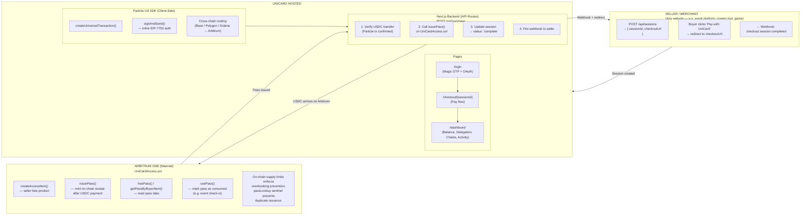

<p align="center">
  
</p>

It is a **chain-abstracted checkout engine** — the Stripe of Web3. Sellers integrate a single API call. Buyers pay with any token on any chain. Settlement always arrives as **USDC on Arbitrum One**, with an on-chain access pass minted as proof of purchase.


## Architecture


## Tech Stack

| Layer | Technology |
|-------|------------|
| **Frontend** | Next.js 16 (Pages Router), React 18, Tailwind CSS |
| **Auth** | Magic SDK (OTP + OAuth2) — passwordless login |
| **Smart Accounts** | Particle Network Universal Account SDK — EIP-7702 delegation, cross-chain routing |
| **Smart Contract** | `UniCardAccess.sol` (Solidity 0.8.24, Foundry) — deployed on Arbitrum One |
| **Database** | Prisma ORM → PostgreSQL (Prisma Postgres) |
| **Backend** | Next.js API Routes — session management, purchase verification, webhooks |
| **Signing** | ethers.js v6 — server-side `issuePass()` transactions |
| **Deployment** | Vercel (frontend + serverless API) |

---

## Project Structure

```
unicard/
├── contracts/                  # Foundry project
│   └── src/UniCardAccess.sol   # On-chain access pass contract
├── prisma/
│   ├── schema.prisma           # Database schema (PostgreSQL)
│   └── seed.ts                 # Seed access items
├── scripts/
│   └── sync-chain-items.mjs    # Register items on-chain + patch DB
├── src/
│   ├── components/
│   │   ├── BuyPassButton.tsx    # Cross-chain purchase flow
│   │   ├── CheckoutPageContent.tsx  # Checkout UI (client-only)
│   │   ├── DelegationCard.tsx   # EIP-7702 delegation status
│   │   ├── PassCard.tsx         # On-chain receipt card
│   │   ├── Providers.tsx        # SDK providers (client-only)
│   │   └── UnifiedBalanceCard.tsx
│   ├── hooks/
│   │   ├── MagicProvider.tsx    # Magic SDK context
│   │   └── UniversalAccountProvider.tsx  # Particle UA + delegation
│   ├── lib/
│   │   ├── contracts.ts         # Arbitrum contract interactions
│   │   └── db.ts                # Prisma client
│   └── pages/
│       ├── api/
│       │   ├── sessions.ts      # POST: create session, GET: fetch session
│       │   ├── purchase.ts      # Verify payment + issue on-chain pass
│       │   ├── check-pass.ts    # Check if buyer holds a pass
│       │   ├── items.ts         # List access items
│       │   └── passes.ts        # List issued passes
│       ├── checkout/[sessionId].tsx  # Checkout page (SSR + client dynamic)
│       ├── dashboard.tsx        # Wallet, balance, activity
│       ├── demo.tsx             # Example seller storefront
│       ├── demo/checkout.tsx    # Example seller checkout
│       └── login.tsx            # Passwordless login
└── example.env                 # Environment variable template
```

## Getting Started

### Prerequisites

- Node.js 18+
- PostgreSQL database (or [Prisma Postgres](https://www.prisma.io/postgres))
- [Magic](https://magic.link) API key
- [Particle Network](https://particle.network) project credentials
- Arbitrum wallet with ETH (for issuing passes)

### Setup

```bash
# Clone
git clone https://github.com/baptonic3/unicard.git
cd unicard

# Install dependencies
npm install

# Configure environment
cp example.env .env

# Set up database
npx prisma generate
npx prisma db push
npm run db:seed

# Register items on-chain (requires DEPLOYER_PRIVATE_KEY)
node scripts/sync-chain-items.mjs

# Start dev server
npm run dev
```

### Environment Variables

> **Note:** To run the full flow locally, you must deploy your own copy of `UniCardAccess.sol` using the `DEPLOYER_PRIVATE_KEY`, since the contract enforces `onlyOwner` access.

