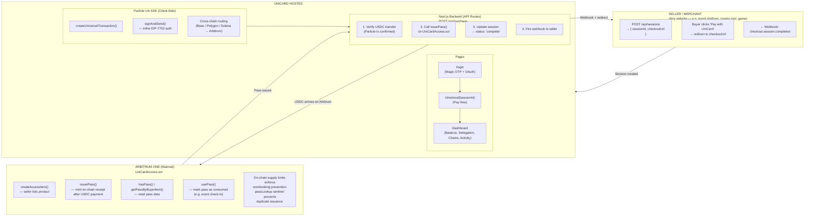

# UniCard — System Architecture

```mermaid
flowchart LR
    subgraph SELLER["SELLER / MERCHANT\n(Any website — e.g. event platform, creator tool, game)"]
        S1["POST /api/sessions\n→ { sessionId, checkoutUrl }"]
        S2["Buyer clicks 'Pay with UniCard'\n→ redirect to checkoutUrl"]
        S3["← Webhook: checkout.session.completed"]
    end

    subgraph UNICARD["UNICARD HOSTED"]
        subgraph PAGES["Pages"]
            P1["/login\n(Magic OTP + OAuth)"]
            P2["/checkout/[sessionId]\n(Pay flow)"]
            P3["/dashboard\n(Balance, Delegation, Chains, Activity)"]
        end

        subgraph SDK["Particle UA SDK (Client-Side)"]
            SDK1["createUniversalTransaction()"]
            SDK2["signAndSend()\n— inline EIP-7702 auth"]
            SDK3["Cross-chain routing\n(Base / Polygon / Solana → Arbitrum)"]
        end

        subgraph API["Next.js Backend (API Routes)\nPOST /api/purchase"]
            API1["1. Verify USDC transfer\n(Particle tx confirmed)"]
            API2["2. Call issuePass()\non UniCardAccess.sol"]
            API3["3. Update session\n→ status: 'complete'"]
            API4["4. Fire webhook to seller"]
        end
    end

    subgraph ARB["ARBITRUM ONE (Mainnet)\nUniCardAccess.sol"]
        C1["createAccessItem()\n— seller lists product"]
        C2["issuePass()\n— mint on-chain receipt\nafter USDC payment"]
        C3["hasPass() / getPassByBuyerItem()\n— read pass data"]
        C4["usePass()\n— mark pass as consumed\n(e.g. event check-in)"]
        NOTE["On-chain supply limits enforce\noverbooking prevention.\npassLookup sentinel prevents\nduplicate issuance."]
    end

    SELLER -->|"Session created"| UNICARD
    P1 --> P2 --> P3
    SDK --> API
    API -->|"USDC arrives on Arbitrum"| ARB
    ARB -->|"Pass issued"| API
    API -->|"Webhook + redirect"| SELLER
```